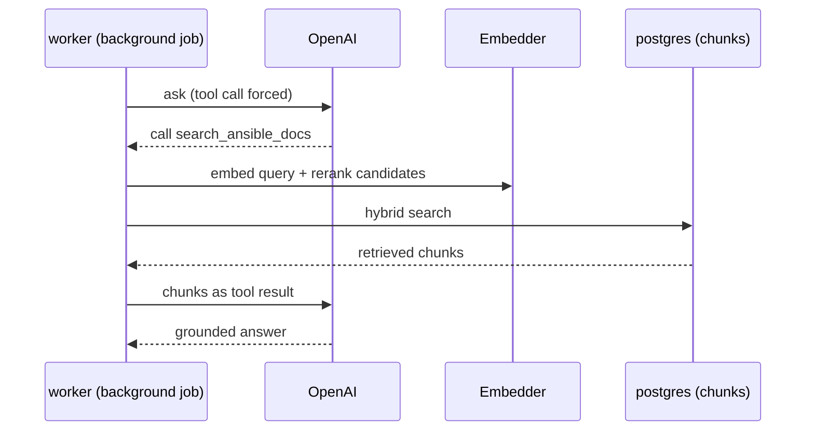
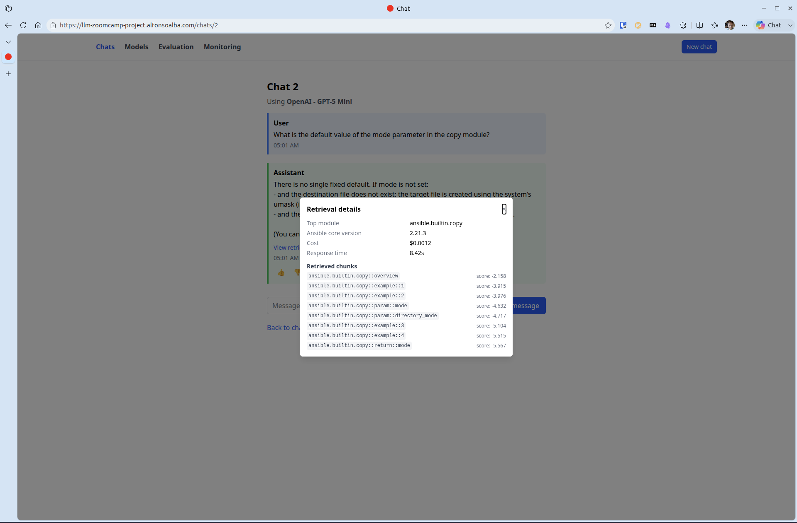
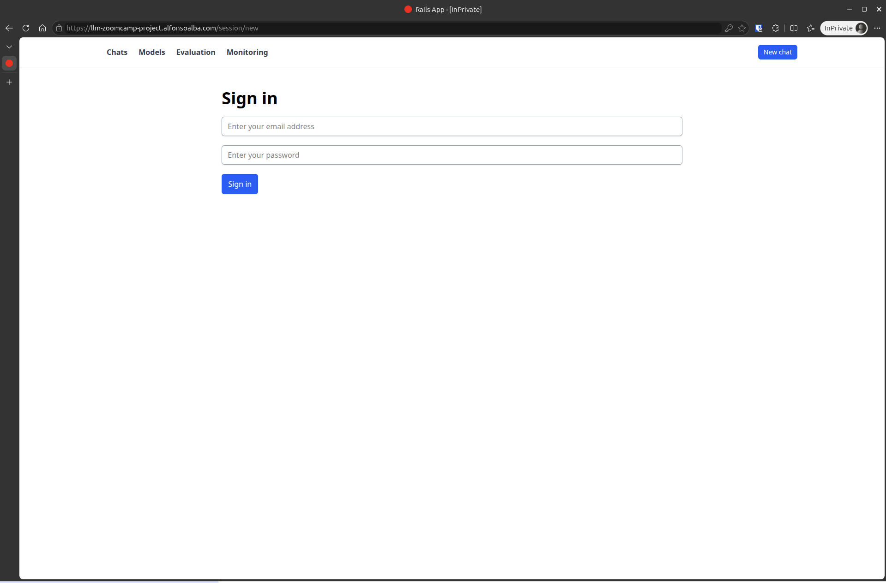
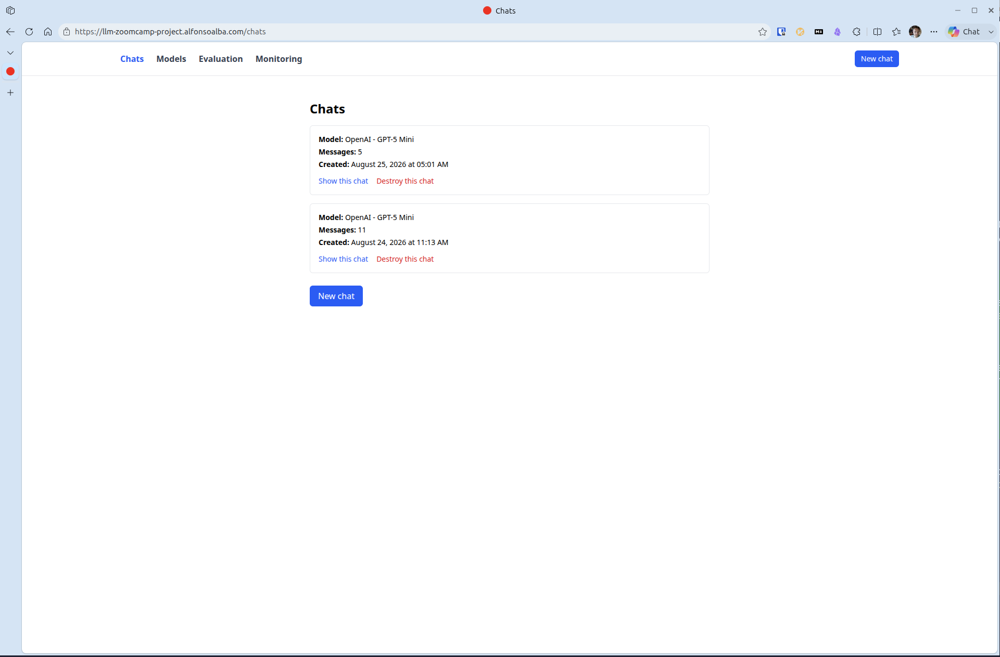
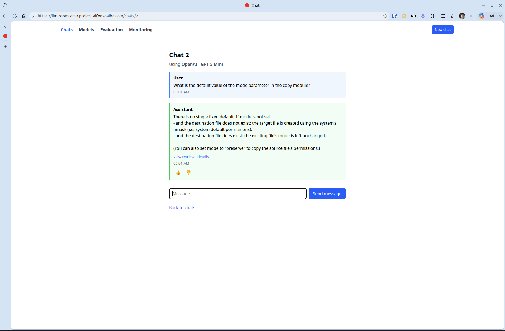
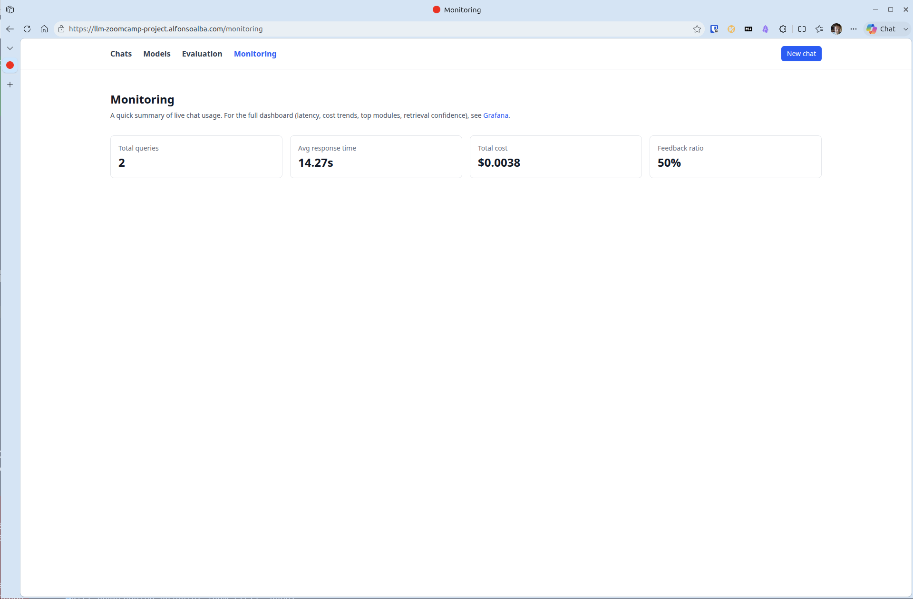
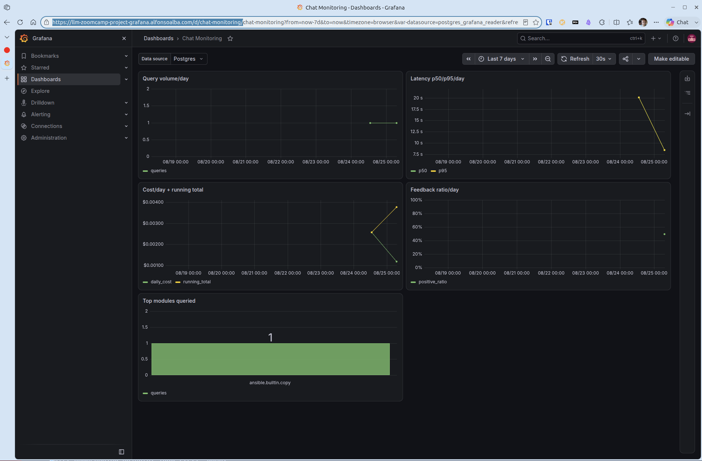

# Ansible Module-Reference RAG Assistant

LLM Zoomcamp capstone project. A chat assistant that answers questions about `ansible.builtin` Ansible modules, grounded in the real, current module documentation instead of what the model remembers from training.

## Problem

Ansible modules change: parameters get renamed, deprecated, replaced. An LLM's knowledge has a training cutoff, so it can confidently answer with information that used to be true and no longer is. I use Ansible often, and this has bitten me more than once — for example, `ansible.builtin.apt_key` is deprecated in favor of `ansible.builtin.deb822_repository`, but a model trained before that change will happily generate a task using `apt_key` anyway.

This app fixes that by retrieving the actual `ansible.builtin` documentation before answering, and citing what it used. Measured on 450 real questions against a fixed ground truth: grounded answers are correct 77.8% of the time, versus 56.9% without retrieval — see [Evaluation](#review-checklist) below for how this is measured.

## Motivation

**Real data over a toy dataset.** I wanted to use a real, changing knowledge source instead of a synthetic one, because the decisions that matter only show up with real data. What happens when a new Ansible release changes a module? How do you keep a ground-truth evaluation set meaningful when the underlying docs it was generated from can change under it? Do you track version history, or only ever serve the latest? None of these questions come up if the data is fake. `ansible.builtin`'s docs are public, structured (`ansible-doc -j` gives clean JSON, no scraping), and change often enough to make these real problems.

**A stack I already know.** The course teaches RAG concepts using a mostly Python stack. I built this in Ruby on Rails with Postgres instead, on purpose — I wanted to focus on learning and applying the course's concepts (retrieval, evaluation, monitoring), not on learning a new language and those concepts at the same time. The one exception: embedding and reranking models. Ruby doesn't have mature equivalents to `sentence-transformers`, so those run in a small Python sidecar service that Rails calls over HTTP.

## Architecture

```
browser ──▶ web (Rails)
              │
              ▼
          postgres (pgvector + full-text search, also the job queue)
              ▲
              │
          worker (Rails + ansible-core) ──▶ embedder (Python, FastAPI)

grafana ──▶ reads postgres directly (read-only)
```

`web` and `worker` never call each other directly — `web` enqueues a background job by writing a row to Postgres, `worker` picks it up from there, does the retrieval + calls OpenAI, and writes the reply back to Postgres. `web`'s UI updates live via Action Cable once that reply lands.

- **`web`** — the Rails app: chat UI, sign-in, monitoring/evaluation pages. Pure Ruby.
- **`worker`** — same Rails codebase, different build target: runs the background jobs (chat responses, weekly document ingestion) and additionally has `ansible-core` installed, since it's the one place that calls `ansible-doc` directly.
- **`postgres`** — one table (`chunks`) holds both a `pgvector` column (semantic search) and a full-text `tsvector` column (keyword search), so hybrid search is one query, not two systems to keep in sync.
- **`embedder`** — a small FastAPI service, Python. Loads the embedding and reranking models once at startup and serves them over HTTP. No Ansible-specific logic — just ML inference, callable by `web` or `worker`.
- **`grafana`** — a pre-provisioned dashboard reading `web`/`worker`'s logged chat data, read-only Postgres access.

Every design decision (and the ones that got revised mid-project, and why) is written up under [`openspec/`](openspec/) — see the [review checklist](#review-checklist) below for links to the specific parts relevant to grading.

## How to review

Two ways to try the app — pick whichever is easier for you.

### Option A: the deployed app

Live at **https://llm-zoomcamp-project.alfonsoalba.com**. Sign in with:

- Email: `llm-zoomcamp@email.com`
- Password: `LeTMeiN!!`

Monitoring dashboard: **https://llm-zoomcamp-project-grafana.alfonsoalba.com** (login: `admin` / `LeTMeiN!!`).

The OpenAI budget behind this deployment is small (a few dollars). If chat stops responding because it ran out, that's why — use Option B instead.

### Option B: run it locally with Docker

You'll need Docker installed. Clone the repo, then create a `.env` file at the repo root with this content (everything works as-is except the OpenAI key, which you need to supply yourself):

```sh
POSTGRES_USER=llm_zoomcamp
POSTGRES_PASSWORD=devpassword
POSTGRES_DB=llm_zoomcamp_development
RAILS_MASTER_KEY=e60e8357993cbb5250e42da19052d5aa
OPENAI_API_KEY=changeme   # <- put your own OpenAI API key here
GRAFANA_ADMIN_PASSWORD=devpassword
GRAFANA_DB_PASSWORD=devpassword
ADMIN_EMAIL=reviewer@example.com
ADMIN_PASSWORD=devpassword
```

(`RAILS_MASTER_KEY` isn't a value you're meant to invent — it's the fixed key that decrypts this repo's committed `rails_app/config/credentials.yml.enc`, which only holds Rails' own boilerplate `secret_key_base`. See [Note for Rails/Ruby developers](#note-for-railsruby-developers) for why every other secret is a plain env var instead.)

Then:

```sh
docker compose up -d --build
```

This builds and runs the same images the production deployment uses — Rails app, worker, Postgres, embedder, Grafana. First boot has an empty knowledge base; populate it once with:

```sh
docker compose exec worker bin/rails runner 'IngestAnsibleModulesJob.perform_now'
```

Takes under a minute, ~1,500 chunks. Then open http://localhost:3000, sign in with the `ADMIN_EMAIL`/`ADMIN_PASSWORD` above, and Grafana at http://localhost:3001.

## Review checklist

Each subsection below covers one grading criterion from the [course rubric](https://github.com/DataTalksClub/llm-zoomcamp/blob/main/project.md#evaluation-criteria), with links straight to the code and specs that back it up. The archived changes under [`openspec/changes/archive/`](openspec/changes/archive/) describe *how* and *why* each part was built, including revisions made mid-project.

### Retrieval flow

Every chat turn calls a real knowledge base before answering. The [`SearchAnsibleDocs`](rails_app/app/tools/search_ansible_docs.rb) tool runs hybrid (keyword + vector) search with reranking against the `chunks` table — real, ingested `ansible.builtin` documentation, not a static snippet. This tool call isn't left optional: [`chat.with_tools(search_tool, GetModuleDetails, choice: :search_ansible_docs)`](rails_app/app/jobs/chat_response_job.rb#L24) forces it on the first round of every message.

When a user submits a question, `worker` picks it up as a background job. This is what it does:



In the diagram you'll notice how we always use the query to retrieve documents from our knowledge base — [the call is forced](rails_app/app/jobs/chat_response_job.rb#L24), not left to the model's judgment. This was not the original behavior. While testing `gpt-5-mini`, we realized the model already knows common Ansible module names well enough from training to skip the search tool and answer from memory alone. Forcing the call — and adding a system prompt that explains why (the ingested corpus is pinned to a specific `ansible-core` version, which can differ from what the model recalls) — is what makes the knowledge base a real part of every answer, not just an optional fallback. Full writeup: [`guarantee-retrieval-grounding`](openspec/changes/archive/2026-08-23-guarantee-retrieval-grounding/).

Citations are opt-in, not forced on the reader: every reply has a "View retrieval details" link showing exactly which chunks were retrieved, their scores, the resolved `ansible-core` version, cost, and response time —



Spec: [ansible-retrieval](openspec/specs/ansible-retrieval/spec.md).

### Retrieval evaluation

Four retrieval strategies are scored against the same ground truth and the same top-K the live app actually uses: [`Eval::RetrievalEvaluator::STRATEGIES = %i[keyword vector hybrid hybrid_rerank]`](rails_app/app/services/eval/retrieval_evaluator.rb#L6), with [`TOP_K = 8`](rails_app/app/services/eval/retrieval_evaluator.rb#L7) matching `SearchAnsibleDocs::RESULT_LIMIT` — the evaluation isn't measuring a different setup than what's deployed.

| Retrieval strategy | Hit rate | MRR |
|---|---|---|
| Keyword only | 0.2% | 0.1% |
| Vector only | 63.1% | 45.9% |
| Hybrid | 61.3% | 45.3% |
| Hybrid + rerank | 71.6% | 53.3% |

`hybrid_rerank` wins on both metrics, and it's the strategy the live app is actually wired to use: [`ChatResponseJob::RETRIEVAL_STRATEGY = "hybrid_rerank"`](rails_app/app/jobs/chat_response_job.rb#L2). Not an arbitrary default — the one that scored best.

Spec: [ansible-evaluation](openspec/specs/ansible-evaluation/spec.md).

### LLM evaluation

This is where we measure what the Problem section above only argues: how much the model's own memory differs from what it can answer once our retrieval system hands it the real, pinned documentation. These are two different approaches to producing the final answer, not two variations of the same prompt: every ground-truth question is asked twice — once through the app's real tool-calling setup, once as a plain chat with no tools — and both answers are judged against the pinned ground truth by an LLM judge: [`Eval::LlmEvaluator#evaluate_row`](rails_app/app/services/eval/llm_evaluator.rb#L53-L67) calls [`Judges::ParamAccuracyJudge`](rails_app/app/services/eval/judges/param_accuracy_judge.rb) to check the answer's stated type/default/choices (or deprecation status) against the real values, returning `CORRECT`/`INCORRECT`/`NOT_STATED`.

| | Accuracy |
|---|---|
| With retrieval (RAG) | 77.8% |
| Without retrieval | 56.9% |

The RAG condition is the same forced-tool-call setup described in [Retrieval flow](#retrieval-flow) above, not a separate mock: [`ask_with_tools`](rails_app/app/services/eval/llm_evaluator.rb#L69-L72) uses `chat.with_tools(..., choice: :search_ansible_docs)`, mirroring [`ChatResponseJob`](rails_app/app/jobs/chat_response_job.rb#L24). It's the one wired into the live app — not a result computed and then set aside.

These numbers aren't fixed in stone — see [Running the evaluation suite](#running-the-evaluation-suite) below to reproduce them yourself.

Spec: [ansible-evaluation](openspec/specs/ansible-evaluation/spec.md).

### Interface

There are two applications here, not one. [`rails_app`](rails_app/) is the web application itself — a real chat UI (sign in, ask a question, watch the answer stream in), not a script or a notebook: [`root "chats#index"`](rails_app/config/routes.rb#L27) is what you land on after signing in, and [`resources :chats do resources :messages`](rails_app/config/routes.rb#L2-L4) is what handles asking a question and getting a reply.

[`embedder`](embedder/) is a small FastAPI service exposing [`POST /embed`](embedder/main.py#L42-L47) and [`POST /rerank`](embedder/main.py#L50-L56) — a real HTTP API, called by `web`/`worker` over the network, not a function imported in-process. It exists because embedding and reranking need `sentence-transformers`, and Ruby has no mature equivalent; rather than abandon Rails for the whole project just to get that one library, the Python dependency was isolated to the one place that actually needs it (see [Motivation](#motivation) above).

Spec: [chat-interface](openspec/specs/chat-interface/spec.md), [embedding-service](openspec/specs/embedding-service/spec.md).

  

### Ingestion pipeline

Refreshing the knowledge base against the *same* `ansible-core` version is fully automated, no notebook or manual step involved: [`recurring.yml`](rails_app/config/recurring.yml#L16-L19) schedules [`IngestAnsibleModulesJob`](rails_app/app/jobs/ingest_ansible_modules_job.rb) to run every week. The job pulls fresh docs via [`AnsibleDocClient.fetch`](rails_app/app/services/ansible_doc_client.rb), chunks them with [`Ingestion::Chunker`](rails_app/app/services/ingestion/chunker.rb), embeds every chunk, and replaces the `chunks`/`ansible_modules` tables in one transaction.

We didn't reach for an external orchestrator (Kestra, dlt, Airflow, Prefect) for this, and it wasn't a shortcut — it's because the interesting problem here isn't scheduling a job, it's *moving to a new `ansible-core` version*, and we don't yet have good answers for that: should multiple versions be servable side by side? What does re-running the ground-truth/evaluation pipeline mean when the module docs it was generated from just changed under it? Should evaluation across versions itself be automated before a version is ever promoted? Wiring an orchestrator around a process whose actual shape is still unclear felt like solving the wrong problem, so a version bump is a deliberate, manual sequence today:

1. Rebuild the `worker` image — [`uv tool install ansible-core`](rails_app/Dockerfile#L28) isn't version-pinned, so a plain rebuild picks up whatever's current on PyPI.
2. Run [`bin/rails eval:all`](rails_app/lib/tasks/eval.rake#L49-L73), which regenerates ground truth against the new corpus and re-scores retrieval, LLM, and compositional evaluation, writing [`data/eval_results.json`](rails_app/app/services/eval/eval_results.rb) — the same suite behind every number in this checklist.
3. Look at the new numbers before deciding anything shipped.
4. Redeploy the new `worker` image.

Automating that safely needs more investigation and testing than we could give it here, so it stayed manual on purpose rather than being automated on a guess.

Spec: [ansible-ingestion](openspec/specs/ansible-ingestion/spec.md).

### Monitoring

We built both of the two things this criterion asks about, not just one. User feedback is collected on every answer: [`FeedbacksController#create`](rails_app/app/controllers/feedbacks_controller.rb) saves a 👍/👎 rating attached to the message, via [the buttons rendered under every assistant reply](rails_app/app/views/messages/_feedback.html.erb).

There's also a dashboard — actually two. In-app, [`MonitoringsController#show`](rails_app/app/controllers/monitorings_controller.rb) computes total queries, average response time, total cost, and the feedback ratio directly from `RetrievalLog`/`Feedback`, live off the same Postgres database the app writes to — see it live at [`/monitoring`](https://llm-zoomcamp-project.alfonsoalba.com/monitoring):



For deeper analysis, [Grafana](https://llm-zoomcamp-project-grafana.alfonsoalba.com/d/chat-monitoring/) reads that same database directly (see the [architecture](#architecture) section) and provisions [5 panels](grafana/dashboards/chat-monitoring.json): query volume/day, latency p50/p95/day, cost/day + running total, feedback ratio/day, and top modules queried:



Spec: [monitoring](openspec/specs/monitoring/spec.md).

### Containerization

[`docker-compose.yml`](docker-compose.yml) is the whole stack, not just the Rails app: `postgres`, `embedder`, `web`, `worker`, and `grafana` are all defined, networked, and given a real healthcheck each — `pg_isready` for Postgres, Python's `urllib` for the embedder, Ruby's `net/http` for `web`, a Solid Queue heartbeat check for `worker`. [`web`'s `depends_on: worker: condition: service_healthy`](docker-compose.yml#L44-L48) is what makes this an orchestrated stack rather than five services that just happen to share a network — `web` won't come up (and silently accept chats nothing answers) if `worker` isn't actually healthy.

`web` and `worker` build from [one shared `rails_app/Dockerfile`](rails_app/Dockerfile), not two drifting copies of the same Ruby/bundler setup — `target: web` and `target: worker` in the compose file pick the [`web`](rails_app/Dockerfile#L14-L23)/[`worker`](rails_app/Dockerfile#L25-L30) stage off the same `base`.

Deployment uses the same containers, not a separate path: [`config/deploy.yml`](config/deploy.yml) points [Kamal](https://kamal-deploy.org/)'s `builder` at [that same Dockerfile and `target: web`](config/deploy.yml#L39-L46), and `worker`/`embedder`/`grafana`/`postgres` are declared as [Kamal accessories](config/deploy.yml#L64-L131) — plain Docker containers on the VM, the same images `docker-compose.yml` builds locally. [Kamal](https://kamal-deploy.org/) is the standard deployment tool in the Rails world (built by 37signals, bundled into new Rails apps by default since Rails 8) — another instance of reaching for the stack's own conventional tooling rather than a custom setup.

Spec: [deployment](openspec/specs/deployment/spec.md).

### Reproducibility

[How to review](#how-to-review) above gives two working paths on purpose — a deployed instance for a zero-setup look, and a `.env` snippet you can paste as-is to run the whole stack locally, in case the deployment runs out of OpenAI budget or you'd rather see it run yourself.

There's no separate dataset to download or lose track of: the knowledge base is fetched live from `ansible-doc` on ingestion (see [Ingestion pipeline](#ingestion-pipeline) above), and every chunk is stamped with the [`ansible_core_version`](rails_app/app/jobs/ingest_ansible_modules_job.rb#L8) it came from — so "which data" is always traceable to a specific, resolvable version rather than a static file that can go stale or disappear.

Dependency versions are pinned where it matters most: [`Gemfile.lock`](rails_app/Gemfile.lock) and [`uv.lock`](embedder/uv.lock) pin every gem and Python package exactly, and the Dockerfile pins its base images — [`ruby:4.0-slim`](rails_app/Dockerfile#L1) and [`pgvector/pgvector:pg18`](docker-compose.yml#L3). Not everything is, though: `grafana` is left on [`:latest`](docker-compose.yml#L81) in both `docker-compose.yml` and `config/deploy.yml`, and [`mise.toml`](mise.toml#L3-L9)'s locally-managed dev tools (`ruby`, `python`, `uv`, `ansible-core`) are all `"latest"` rather than pinned — a real gap, not one we're glossing over.

Spec: [dev-toolchain](openspec/specs/dev-toolchain/spec.md).

### Best practices

- **Hybrid search** — yes: [`Retrieval::HybridSearch`](rails_app/app/services/retrieval/hybrid_search.rb) combines keyword and vector search, and it's evaluated against the alternatives in [Retrieval evaluation](#retrieval-evaluation) above. Spec: [ansible-retrieval](openspec/specs/ansible-retrieval/spec.md).
- **Document re-ranking** — yes: [`RerankerClient.rerank`](rails_app/app/services/reranker_client.rb) re-scores hybrid search's candidates via the embedder's cross-encoder before the top results are used, called from [`SearchAnsibleDocs#execute`](rails_app/app/tools/search_ansible_docs.rb#L26). Spec: [ansible-retrieval](openspec/specs/ansible-retrieval/spec.md).
- **User query rewriting** — no, not implemented.

### Bonus points

**Deployment to the cloud.** Live at [https://llm-zoomcamp-project.alfonsoalba.com](https://llm-zoomcamp-project.alfonsoalba.com), monitoring at [https://llm-zoomcamp-project-grafana.alfonsoalba.com](https://llm-zoomcamp-project-grafana.alfonsoalba.com) — both already linked in [How to review](#how-to-review) above, deployed the way described in [Containerization](#containerization).

For the remaining 3 points: we don't want to guess at what would earn them — looking forward to hearing in feedback what you'd want to see, and happy to build it.

## Development setup

This project uses [mise](https://mise.jdx.dev/) to manage all local development tools and system packages. Install `mise` itself first: https://mise.jdx.dev/installing-mise.html

Before running anything else, create a `mise.local.toml` file at the repo root (gitignored, personal to your machine) restricting `mise` to your platform's package manager:

**Linux:**

```toml
[settings]
system_packages.managers = ["apt"]
```

**macOS:**

```toml
[settings]
system_packages.managers = ["brew"]
```

This is required, not optional. Without it, `mise` tries to install *every* declared package manager's packages — including bootstrapping Homebrew on Linux (or the reverse) for entries meant for the other platform.

**macOS only:** install Xcode Command Line Tools before bootstrapping (`xcode-select --install`) — the `pg` gem needs a C compiler to build its native extension.

Once `mise.local.toml` is in place:

```sh
mise bootstrap
```

This provisions Ruby and everything else declared in `mise.toml` — no separate install step needed.

### Running the app

Copy `.env.example` to `.env` and fill in real values (or use the snippet in [Option B](#option-b-run-it-locally-with-docker) above). Then:

```sh
docker compose up -d --build
```

`web` and `worker` build from the same Rails codebase (`rails_app/`) via two Docker build targets — `worker` additionally has `ansible-core` installed. Database setup runs automatically on first boot (`bin/docker-entrypoint`) — nothing to run by hand.

Once the app is up, sign in with your `ADMIN_EMAIL`/`ADMIN_PASSWORD` at http://localhost:3000. Every page requires signing in — there's no registration, by design (see [authentication](openspec/specs/authentication/spec.md)). The monitoring dashboard is at http://localhost:3001, and `/monitoring` and `/evaluation` are in-app pages under the main nav.

### Populating the knowledge base (ingestion)

`worker` runs `IngestAnsibleModulesJob` on a recurring weekly schedule (Solid Queue, `rails_app/config/recurring.yml`): fetches every `ansible.builtin` module's docs via `ansible-doc`, splits them into chunks (one per parameter, named example, return value, plus one module overview), embeds each chunk via the `embedder` sidecar, and stores the result in Postgres. Each run fully replaces the previous data set, atomically — the app is never left with an empty or half-populated knowledge base mid-run.

To populate the database immediately instead of waiting for the first scheduled run:

```sh
docker compose exec worker bin/rails runner 'IngestAnsibleModulesJob.perform_now'
```

Takes well under a minute, ~71 modules and ~1,500 chunks.

### Running locally without Docker rebuilds

`docker compose up -d --build` is the production-equivalent path — full container rebuilds on every code change. For faster iteration, `web`/`worker`/`embedder` can run as local processes instead, while Postgres and Grafana stay in `docker compose`:

```sh
# 1. Infra only
docker compose up -d postgres grafana

# 2. Prepare the local database (schema + Grafana reader role) — one-time,
#    or again after a schema change
mise run db:prepare

# 3. Start the embedder sidecar locally (separate terminal). First run
#    re-downloads model weights from Hugging Face Hub — the Docker image
#    bakes them in at build time, a plain local `uv sync` doesn't.
cd embedder && uv run uvicorn main:app --reload --port 8000

# 4. Populate the local knowledge base — requires the embedder from step 3
#    already running
mise run ingest

# 5. Start web + css + worker together (separate terminal)
cd rails_app && bin/dev
```

Copy `.env.example` to `.env` at the repo root, same as the Docker path — `bin/dev`, `rails console`, `rails runner`, and tests all load it automatically via the `dotenv-rails` gem. `EMBEDDER_URL` in `.env.example` defaults to `http://localhost:8000`, matching step 3 — it's only read by locally-run `web`/`worker` processes, not the containerized path.

### Running the evaluation suite

```sh
cd rails_app
bin/rails eval:all
```

This regenerates ground truth, then runs retrieval, LLM, and compositional evaluation against it, and writes `data/eval_results.json` — what's shown at `/evaluation`. Add `SKIP_GROUND_TRUTH=1` to reuse the existing `data/ground_truth.csv` instead of regenerating it, and `EVAL_SAMPLE_SIZE=N` to limit the (slower, real-API-call) LLM evaluation to a sample.

A full run makes hundreds of real OpenAI API calls — it can take a few hours and cost around $4. `EVAL_SAMPLE_SIZE` is the way to cut that down if you just want to confirm the pipeline works.

Ground truth is pinned to a specific `ansible-core` version at generation time and only regenerated deliberately — not on every ingestion refresh — so evaluation numbers stay comparable run over run. See [ansible-evaluation](openspec/specs/ansible-evaluation/spec.md) for why.

## Note for Rails/Ruby developers

If you're an experienced Rails developer and something here looks off: this project was built with [Claude Code](https://claude.com/claude-code), driven through [OpenSpec](https://github.com/Fission-AI/OpenSpec) (every feature went through a proposal → design → tasks → implementation cycle — see [`openspec/changes/archive/`](openspec/changes/archive/) for the full history, including decisions that got revised mid-project once implementation surfaced a wrong assumption).

The priority throughout was applying the LLM Zoomcamp's concepts — retrieval, evaluation, monitoring, deployment — not building the most idiomatic or best-architected Rails app possible. Some choices trade architectural cleanliness for speed or simplicity where a from-scratch senior Rails project might do things differently.

One deliberate example: every secret in this app is a plain environment variable, not a Rails encrypted credential. Partly for consistency (Docker/Kamal both inject env vars naturally), but also because it makes review easier — there's no separate secure channel needed to hand a reviewer a master key for real secrets. The one Rails-credentials key that *is* shared above (`RAILS_MASTER_KEY`) only decrypts an unused, boilerplate `secret_key_base`.

Another one, not deliberate this time, more a known gap: [`ChatResponseJob`](rails_app/app/jobs/chat_response_job.rb) holds more logic than a job class should — retrieval-strategy selection, the system prompt, and building the `RetrievalLog` row are all inline rather than pulled into their own service objects. It works and it's tested, but a next pass would extract most of that out and leave the job as thin orchestration.
